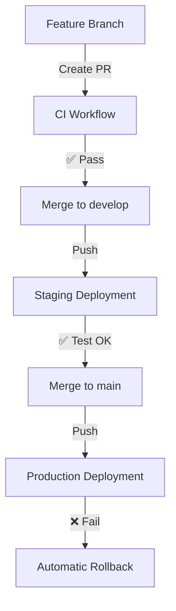

# GitHub Actions Workflows

This directory contains the CI/CD workflows for the Chirag Portfolio Next.js application.

## 🚀 Workflows Overview

### 1. **CI Workflow** (`ci.yml`)
- **Purpose**: Continuous Integration for pull requests
- **Triggers**: 
  - Pull requests to `main` or `develop` branches
  - Manual dispatch
- **Actions**:
  - ✅ Lint code with ESLint
  - ✅ Build application
  - ✅ Run tests (if available)
  - ✅ Security audit
  - ✅ Comment on PR with results

### 2. **Production Deployment** (`deploy-production.yml`)
- **Purpose**: Deploy to production Oracle Cloud server
- **Triggers**:
  - Push to `main` branch
  - Manual dispatch
- **Actions**:
  - ✅ Build and test application
  - ✅ Create deployment package
  - ✅ Transfer to production server
  - ✅ Deploy with Docker containers
  - ✅ Health check verification
  - ✅ Automatic backup and cleanup

### 3. **Staging Deployment** (`deploy-staging.yml`)
- **Purpose**: Deploy to staging environment
- **Triggers**:
  - Push to `develop` or `staging` branches
  - Pull requests (build only)
  - Manual dispatch
- **Actions**:
  - ✅ Build and test application
  - ✅ Deploy to staging environment
  - ✅ Use staging-specific configuration
  - ✅ Comment on PRs with staging URL

## 🔧 Required Secrets

Configure these in **Settings > Secrets and variables > Actions**:

### Production
- `ORACLE_CLOUD_HOST` - Production server IP
- `ORACLE_CLOUD_USER` - SSH username (usually `opc`)
- `ORACLE_CLOUD_SSH_KEY` - Private SSH key content

### Staging (Optional)
- `ORACLE_CLOUD_STAGING_HOST` - Staging server IP
- `ORACLE_CLOUD_STAGING_USER` - Staging SSH username
- `ORACLE_CLOUD_STAGING_SSH_KEY` - Staging SSH key

## 🌍 Required Environments

Create these in **Settings > Environments**:

1. **production**
   - Deployment branch: `main`
   - Protection rules: Required reviewers (optional)

2. **staging** 
   - Deployment branches: `develop`, `staging`
   - Protection rules: None required

## 🔄 Deployment Flow



## 📊 Workflow Status

Check workflow status:
- **Actions Tab**: View all workflow runs
- **PR Comments**: Automatic status comments
- **Deployment Environments**: Track deployment history

## 🛠️ Customization

### Adding Custom Steps

Edit the workflow files to add custom deployment steps:

```yaml
- name: Custom Pre-deployment
  run: |
    echo "Running custom pre-deployment tasks..."
    # Your custom commands here

- name: Custom Post-deployment  
  run: |
    echo "Running post-deployment tasks..."
    # Your custom commands here
```

### Environment Variables

Add environment-specific variables as repository secrets:

```yaml
env:
  CUSTOM_API_URL: ${{ secrets.API_URL }}
  DATABASE_URL: ${{ secrets.DATABASE_URL }}
```

### Notification Integration

Add Slack/Discord/email notifications:

```yaml
- name: Notify Success
  if: success()
  uses: 8398a7/action-slack@v3
  with:
    status: success
    webhook_url: ${{ secrets.SLACK_WEBHOOK }}
```

## 🐛 Troubleshooting

### Common Issues

1. **SSH Connection Failed**
   - Verify server IP in secrets
   - Check SSH key format
   - Ensure public key is on server

2. **Build Failed**
   - Check Node.js version compatibility
   - Verify dependencies in package.json
   - Review build logs in Actions tab

3. **Deployment Failed**
   - Check server disk space
   - Verify Docker is running
   - Review deployment logs

### Debug Commands

```bash
# Check workflow logs
# Go to Actions tab > Select workflow run > View logs

# SSH to server and debug
ssh opc@YOUR_SERVER_IP
docker ps -a
docker-compose logs

# Manual rollback
sudo /opt/chirag-portfolio/deployment/rollback.sh production
```

## 📚 Documentation

For detailed setup instructions, see:
- [CI-CD-SETUP.md](../../CI-CD-SETUP.md) - Complete CI/CD setup guide
- [DEPLOYMENT.md](../../DEPLOYMENT.md) - Manual deployment guide

## 🚀 Quick Start

1. Set up GitHub secrets
2. Create GitHub environments  
3. Push to `develop` branch to test staging
4. Push to `main` branch to deploy production
5. Monitor in Actions tab

Your CI/CD pipeline is ready! 🎉